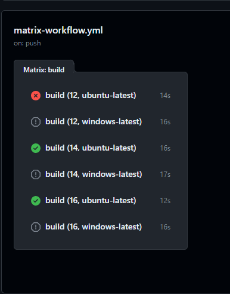
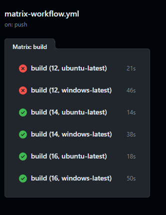

# Controlling Execution Flow

- Sometimes you want to execute specific job at certain condition.

## Notes

Both **Jobs** and **Steps** can be executed via `if` field.

## Jobs

### Jobs Example 1

We can set up a job to run on failure.

```yml
jobs:
  # ...
  on-failure:
    if: failure()
    runs-on: ubuntu-latest
    steps:
      - name: This would run on failure
        run: |
          echo "A job failed here this such detail ${{ github }}"
```

However, the previous job would end up failing since all of the jobs run in parallel. You would always want to make sure to run them sequentially using `needs` keyword.

```yml
on-failure:
  if: failure()
  needs: # some build that this on-failure job waits for in case of failure.
  runs-on: ubuntu-latest
  steps:
    - name: ...
    # ...
```

The `needs` do not always have to run after an immediate job failure (e.g. previous job). This can be used at the end and watch for any failures coming from any previous jobs.

Example

If the pipeline follows as

```
        - Lint  -  -  -  -
      /                     \
Start                          On Failure
      \                     /
        - Build - Deploy  -
```

```yml
needs: [Deploy, Lint]
```

In this case, even if the job, `Build` fails, the `On Failure` will be triggered.

## Steps

- Ignore errors via `continue-on-error` field
- Step result documentation: https://docs.github.com/en/actions/learn-github-actions/contexts#steps-context

### Steps Example 1

Run a test only if a previous step fails. You would always need an id for a step in order to run a step based on its failure.

```yml
  steps
    - name: Test code
      run: npm run test
      id: test-components # adding unique id to reference this step.
    - name: Run if fails
      if: steps.test-components.outcome == 'failure'
      run: echo "Hey, I failed here :("
    - name: Upload test report
      uses: actions/upload-artifact@v3
      with:
        name: test-report
        path: test.json
```

Once you run this, you will find that this did not run. Reason -> our condition does check the result, but the default behavior is not to run the steps if any previous step fails. In order to handle this, we need to insert a new method. We can update the if condition as follows

```yml
- name: Runs if fails
  if: failure() && steps.test-components.outcome == 'failure'
```

For if syntax, it always depends on the environment, so you can omit the syntax `${{ x }}` even though you can still use this.

You can additionally execute your own conditions with the help of Expressions.

### Steps Example 2 - Caching dependencies in case of failure

In case, you want to still download the dependencies and cache them in case of failure, you can activate step using actions/cache

```yml
steps:
  - name: Will file for sure (Caches dependencies)
    uses: actions/cache@v3
    with:
      path: node_modules
      key: deps-node-modules-${{ hashFiles('**/package-lock.json') }}
  - name: Install if not cached
    if: steps.cache.outputs.cache-hit != 'true'
    run: npm ci
```

## Continue On Error

In case, you want to run the job on failure, you can use `continue-on-error`. This will complete the job even if a step fails. This will ensure that your step or job continues even on a failure of that given step.

```yml
- name: Test code
  run: npm run test
  id: test-components # adding unique id to reference this step.
  continue-on-error: true # You can use ${{}} to drive value directly as needed
- name: Upload test report even it fails
  uses: actions/upload-artifact@v3
  with:
    name: test-report
    path: test.json
```

### Context Tips

| Property Name                | Type     | Description                                                                                                                                                                                                                                         |
| ---------------------------- | -------- | --------------------------------------------------------------------------------------------------------------------------------------------------------------------------------------------------------------------------------------------------- | -------------------------------------------------------------------------------------------------------------------------------------------------------------------------------------------------------------------------------------------- |
| `steps.<step_id>.conclusion` | `string` | The result of a completed step after `continue-on-error` is applied. Possible values are `success`, `failure`, `cancelled`, or `skipped`. When a `continue-on-error` step fails, the `outcome` is `failure`, but the final conclusion is `success`. |
| `steps.<step_id>.outcome`    | `string` |                                                                                                                                                                                                                                                     | The result of a completed step before `continue-on-error` is applied. Possible values are success, failure, cancelled, or skipped. When a `continue-on-error` step fails, the `outcome` is `failure`, but the final conclusion is `success`. |

## Special Conditional Functions

Function that gets evaluated when one of the below conditions meet.

- failure()
  - Returns `true` when any previous **Step** or **Job** fails
- success()
  - Returns `true` when a step or job succeeds
- always()
  - Always runs whether success/failure. Or even if it's cancelled.
- cancelled()
  - Returns true if workflow has been cancelled.

## Matrix

In case you want to run the same job with a slight different configuration simultaneously, you can use matrix.

### Matrix Example

```yml
name: Matrix Workflow
on: push
jobs:
  build:
    run-on: ubuntu-latest
    steps:
      - name: Get code
        uses: actions/checkout@v3
      - name: Install Nodejs
        uses: actions/setup-node@v3
        with:
          node-version: 14
      - name: Install Dependencies
        run: npm ci
      - name: Build Project
        run: npm run build
```

If you would like to run the same job with node-version 15, you can use keyword, `strategy` -> `matrix` to copy and tweak value.

```yml
name: Matrix Workflow
on: push
jobs:
  build:
    strategy:
      matrix:
        node-version: [12, 14, 16]
        operating-system: [ubuntu-latest, windows-latest]
    run-on: ubuntu-latest
    steps:
      - name: Get code
        uses: actions/checkout@v3
      - name: Install Nodejs
        uses: actions/setup-node@v3
        with:
          node-version: 14
      - name: Install Dependencies
        run: npm ci
      - name: Build Project
        run: npm run build
```

First, we would create a field `strategy` and create `matrix` values under `strategy`.

```yml
strategy:
  matrix:
    node-version: [12, 14, 16]
    operating-system: [ubuntu-latest, windows-latest]
```

And now we can use them anywhere using `matrix` context.

```yml
run-on: ${{ matrix.operating-system }}
```

```yml
with:
  node-version: ${{ matrix.node-version }}
```

This will clone a job of itself with provided configuration to run in parallel.

This will result the following:


The workflow will stop as soon as one job fails. To prevent rest not running, we can again use the `continue-on-error` at the job level. The overall code should look like,

```yml
name: Matrix Workflow
on:
  push:
    branches:
      - main
jobs:
  build:
    continue-on-error: true
    strategy:
      matrix:
        node-version: [12, 14, 16]
        operating-system: [ubuntu-latest, windows-latest]
    runs-on: ${{ matrix.operating-system }}
    steps:
      - name: Get code
        uses: actions/checkout@v3
      - name: Install Nodejs
        uses: actions/setup-node@v3
        with:
          node-version: ${{ matrix.node-version }}
      - name: Install Dependencies
        run: npm ci
      - name: Build Project
        run: npm run build
```

Resulting the following :


### Including

`include` in matrix allows you to add the list as a key - value as a new configuration combination. This is different from how we declare above, (node-version, operating-system) because list declared as a matrix key value pair will generate jobs list all combined total in this case 3 x 2 = 6 jobs. But include will only create a new combination of node-version 18 with ubuntu-latest

```yml
strategy:
  matrix:
    node-version: [12, 14, 16]
    operating-system: [ubuntu-latest, windows-latest]
    include:
      - node-version: 18
        operating-system: ubuntu-latest
```

### Excluding
`exclude` in matrix allows you to skip specific combination.

```yml
exclude:
  - node-version: 12
    operating-system: windows-latest
```

## Reusable workflow

You can have workflow that you wanted to use in the other workflow. Like steps, jobs. E.g. one workflow might focus on just deploying while a similar workflow does the same and additionally test and building and others. 

First, we would have to create a workflow that can be used in another workflow.

```yml
name: Reusable Workflow
on: ...
jobs:
  deploy:
    runs-on: ubuntu-latest
    steps:
      - name: Output information
        run: echo "Deploying & uploading"
```

Once created, for the value of `on`, we would like to make sure the workflow runs based on the trigger from another workflow. So we pass in `workflow_call` for the value, `on`.

```yml
on: workflow_call
```

Once we run this job, we can see the `using-reusable-workflow` can import and use the `reusuable-workflow`.

### Passing in values to reusuable workflow

In order to pass in values to the workflow, we need to add `inputs` field to the resuable workflow. Intead of making `on` value `worfklow_call` as a single word, we will update as the following:

```yml
on:
workflow_call:
  inputs:
    some-input:
      description: Required input to run this workflow
      required: true # optionally can be false
      default: Default Value
      type: string # boolean, ... others
```

This will allow to pass in inputs to the workflow. Each `input` requries you to pass in `description`, `required`, `type`. You can optionall pass in `default` when required is `false` and other attributes as needed. The documentation can be found `https://docs.github.com/en/actions/learn-github-actions/contexts#inputs-context`.

